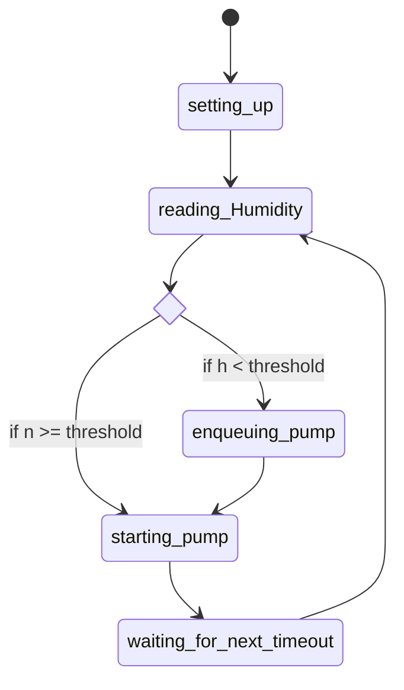

# watering diagram

```mermaid
stateDiagram
    [*] --> setting_up
    setting_up --> reading_Humidity
    state is_dry <<choice>>
    reading_Humidity-->is_dry
    is_dry --> enqueuing_pump: if h < threshold
    is_dry --> starting_pump  : if n >= threshold
    enqueuing_pump --> starting_pump
    starting_pump--> waiting_for_next_timeout
    waiting_for_next_timeout --> reading_Humidity
```
